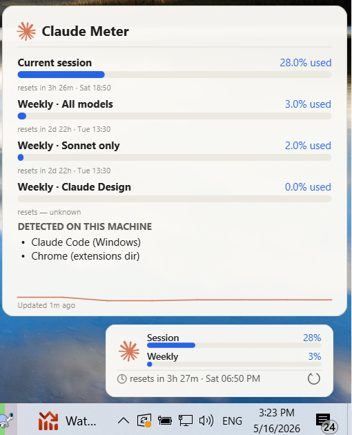

<div align="center">


# Claude Meter

**See exactly how much of your Claude plan you've used — at a glance, in your Windows taskbar.**

Every quota that lives on `claude.ai/settings/usage` — Current session, Weekly · All models, Sonnet only, Opus only, Claude Design, daily routine runs, overage — rendered as a quiet, glanceable pill above your taskbar. Click for an instant refresh. Hover for the full breakdown.

[](LICENSE)


[](../../releases)

<br>

<!-- Replace this with a real screenshot of the ticker + tooltip side by side. -->
<!-- Recommended size: ~1200×600.   Save to assets/screenshot.png. -->


</div>

---

## The problem, in one breath

Your Claude plan has limits — but Claude doesn't show you how much you've used
without opening a webpage and going looking. So you hit a wall mid-thought, then
sit there guessing when it'll reset.

**Claude Meter** is the fuel gauge for your Claude plan. It sits quietly above
your taskbar and shows how much you've got left, all the time, so you're never
surprised.

## What it does

- **Shows everything your usage page shows** — your current session, your weekly
  totals, and a breakdown per model (Sonnet, Opus, Claude Design), plus your daily
  runs and any extra-usage. It figures out your plan automatically.
- **Lives in your tray as a live percentage** — colour-coded green to orange to
  red, so you can glance at it like the clock.
- **A little bar above your taskbar** — shows how much is left and counts down to
  the reset (`resets in 4h 48m`), with a refresh button right there.
- **Hover for the full picture** — every number, plus a mini-graph of the last two
  weeks, in a clean Claude-style design.
- **Doesn't flicker out.** If Claude's servers are busy, it keeps showing your last
  good numbers (with a small amber dot) instead of going blank.
- **Checks gently.** It refreshes on its own every few minutes and slows down when
  you're away, so it never wastes your allowance just by watching.
- **One file, no install.** Download, double-click, done. Turn on "run at startup"
  from the tray menu and forget about it.

## Install (30 seconds)

1. Grab **`ClaudeMeter.exe`** from the [Releases page](../../releases).
2. Drop it in `C:\Tools\` (or anywhere). Double-click.
3. Right-click the tray icon → **Run at startup** so it's there next reboot.

### Prerequisite — Claude Code CLI must be logged in

Claude Meter reads `~/.claude/.credentials.json`, which is written **only** by the [Claude Code CLI](https://claude.com/claude-code) on login. The Claude desktop app and `claude.ai` in the browser use different credential storage that the widget can't read yet (see roadmap).

If you've ever run `claude login` (or just `claude`) on this machine, you're already set. Otherwise:

```cmd
npm install -g @anthropic-ai/claude-code
claude
```

`claude` opens a browser-based login. After you authenticate, it writes the credentials file and the widget picks it up automatically on next refresh. You don't have to actually USE Claude Code for coding — login once and forget it.

If you don't want Node.js, an installer is available at https://claude.com/claude-code that doesn't require it.

> **Browser-only users / desktop-app-only users**: support for reading `sessionKey` from your browser cookies is on the v0.2 roadmap so you won't need to install the CLI just for this widget. For now, the CLI is the path.

### First-launch SmartScreen warning

Windows may show *"Windows protected your PC"* the first time you run `ClaudeMeter.exe`. That's because this binary isn't code-signed (code-signing certificates are $200–400/year, not currently in scope for a hobby project). The code is open-source — you can read every line and rebuild it yourself if you want.

To run it anyway:

1. Click the small **"More info"** link on the SmartScreen dialog
2. Click the **"Run anyway"** button that appears

Windows trusts it on subsequent launches.

## How it differs from the alternatives

There are several great Windows widgets out there. Here's an honest comparison:

| | **Claude Meter** | [Zrnik](https://github.com/Zrnik/claude-usage-windows-taskbar-widget) | [sr-kai's claudeusagewin](https://github.com/sr-kai/claudeusagewin) | [CodeZeno](https://github.com/CodeZeno/Claude-Code-Usage-Monitor) |
|---|:---:|:---:|:---:|:---:|
| Stack | Python + PySide6 | C# / WPF | C# / WPF + WPF-UI | Rust + Win32 GDI |
| Per-model breakdown (Sonnet/Opus/Design) | ✅ | ❌ (unified only) | ⚠️ (Sonnet only) | ❌ (unified only) |
| Daily routine runs | ✅ | ❌ | ❌ | ❌ |
| Overage tracking | ✅ (when API exposes) | ❌ | ✅ | ❌ |
| Plan auto-detect | ✅ | ❌ | ✅ | ❌ |
| Light Claude-brand theme | ✅ | ❌ | ⚠️ (Fluent dark/light) | ⚠️ (dark/light) |
| Keeps last data on API errors | ✅ | ❌ | ⚠️ | ❌ |
| Drop-in logo override | ✅ | ❌ | ❌ | ❌ |
| End-user .exe size | ~70 MB | ~5 MB (needs .NET 8) | ~6 MB (needs .NET 8) | ~3 MB |
| Multi-account | (roadmap) | ✅ | ❌ | ❌ |

If you want the absolute smallest binary, **CodeZeno's Rust version is great**. If you want multi-account side-by-side, **Zrnik's** is your tool. **Claude Meter** is for people who want the full `claude.ai/settings/usage` page replicated in their taskbar, with a quiet design that feels like Anthropic could have shipped it.

## How it works (for the curious)

Claude Meter asks Claude's own usage service for the exact same numbers the
`claude.ai` usage page shows, and lays them out in your taskbar. It reads new
kinds of usage Anthropic might add later without needing an update.

It checks in only every few minutes (and less often when you're idle), so it's
gentle on your allowance — watching the gauge doesn't cost you anything to speak
of. The technical details live in [CLAUDE.md](CLAUDE.md) if you want them.

## Using your own / official logo

The widget loads its logo from the first matching file in:

1. `%APPDATA%\ClaudeMeter\claude_logo.svg` (or `.png`)
2. `<exe dir>\assets\claude_logo.svg`
3. The bundled SVG in `assets/`
4. Falls back to a programmatic Claude asterisk

Drop the official Anthropic mark into any of those paths and the widget picks it up on next launch.

## Configuration

Right-click the tray icon → **Settings…**:

- Refresh interval (default Auto — 7 / 20 min adaptive)
- Manual API-key override
- Toast notifications when crossing 75 % / 90 % / 95 %
- Auto-hide on real fullscreen apps (off by default — won't trigger on maximized windows)
- Position offsets from system tray / taskbar

Settings live in `%APPDATA%\ClaudeMeter\settings.json`.
Usage history (for the sparkline) lives in `%APPDATA%\ClaudeMeter\history.json` — 14 days, ~10-minute buckets.

## Build it yourself

```cmd
git clone https://github.com/JackBhanded/claude-meter
cd claude-meter
build-exe.cmd      :: produces dist\ClaudeMeter.exe
:: …or run from source:
run.cmd
```

Requires Python 3.10+ on PATH. PySide6 is the only heavy dependency.

## Roadmap

- Multi-account side-by-side (cycle through `.credentials.json` profiles)
- Live-tile-style taskbar icon on Windows 11 (Win+W panel via MSIX)
- Linux build (KDE/GNOME tray support is already in Qt)
- Optional Excel/CSV export of the 14-day history
- Localization

PRs welcome.

## Credits & inspiration

Standing on the shoulders of giants. Big thank you to:

- [Zrnik](https://github.com/Zrnik/claude-usage-windows-taskbar-widget) — proved the header-based approach works
- [Sasha Kai (sr-kai)](https://github.com/sr-kai/claudeusagewin) — popularized the tray-icon-as-percentage UX and the overage card
- [CodeZeno](https://github.com/CodeZeno/Claude-Code-Usage-Monitor) — Rust prior art, taught me sensible polling intervals
- [hamed-elfayome's Claude-Usage-Tracker](https://github.com/hamed-elfayome/Claude-Usage-Tracker) — best documentation of the API field shapes
- [f-is-h/Usage4Claude](https://github.com/f-is-h/usage4claude) — first to expose per-model rows

## About the author

<table>
<tr>
<td width="120" valign="top">

</td>
<td valign="top">

Built by **[Jack Bhanded](https://www.sawyouatsinai.com/jewish-dating-team.aspx)**, Lead developer and architect at [SawYouAtSinai](https://www.sawyouatsinai.com). Devotee of innovative technologies and gadgets. Built this because he uses Claude Code daily and wanted to know how much quota was left without leaving the editor.

</td>
</tr>
</table>

Part of a small suite of Claude utilities alongside [Claude Lifeboat](https://github.com/JackBhanded/claude-lifeboat) (backup & restore for your Claude data), [Claude Lifejacket](https://github.com/JackBhanded/claude-lifejacket) (keep every Claude session aware of your projects), [Claude Compass](https://github.com/JackBhanded/claude-compass) (keep every session attuned to how you like to work), and [Claude Parachute](https://github.com/JackBhanded/claude-parachute) (a safety net for the Bash changes Claude Code's /rewind can't see).

## Changelog

See [CHANGELOG.md](CHANGELOG.md) for the version-by-version list of changes.

## License

[MIT](LICENSE) — do whatever you want, just keep the copyright notice.
